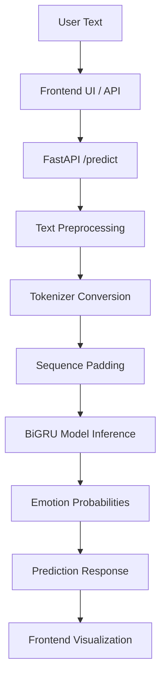

# Emotion Classification with BiGRU


A deep learning NLP application that classifies text into six emotions using a Bidirectional GRU model, with FastAPI inference and an interactive web interface.

## Live Demo

- **Application Web UI:** https://emotion-classification-with-bigru.onrender.com
- **API Endpoint:** https://emotion-classification-with-bigru.onrender.com/predict
- **Health Check:** https://emotion-classification-with-bigru.onrender.com/health
- **Interactive API Docs:** https://emotion-classification-with-bigru.onrender.com/docs

## Overview

This project provides an end-to-end solution for emotion classification, moving beyond generic binary sentiment analysis. It takes raw user text, processes it through a tokenizer, and runs inference via a trained Bidirectional GRU neural network.

The application predicts the most likely emotion from six categories and provides the confidence score alongside a full probability distribution across all six classes:
- sadness 😢
- joy 😄
- love ❤️
- anger 😠
- fear 😨
- surprise 😲

## Features

- **Six-Class Emotion Classification:** Accurately classifies text into six distinct emotional categories.
- **Advanced Inference:** Uses a Bidirectional GRU (BiGRU) model for contextual understanding of text.
- **FastAPI Backend:** Fast and asynchronous API with lifespan management to load models at startup.
- **Text Preprocessing:** Built-in lowercase conversion, punctuation removal, and whitespace normalization.
- **Interactive Web UI:** A responsive browser interface to test the model with live visual breakdowns of emotion probabilities.
- **Health Endpoint:** A `/health` route for monitoring server and model loading status.

## Architecture & How It Works

The system follows a standard NLP inference pipeline hosted behind a web server:



- **`Artifacts/BiGRU_Model.keras`**: The pre-trained Keras BiGRU model.
- **`Artifacts/tokenizer.pkl`**: The saved tokenizer to convert text into integer sequences matching the training dictionary.
- **`main.py`**: The FastAPI backend orchestrating the text processing and model predictions.
- **`static/`**: Contains the HTML, CSS, and JS files for the interactive browser interface.

## Model Architecture

The final selected model is a **Bidirectional GRU (BiGRU)**. Early experiments evaluated standard RNNs, LSTMs, and GRUs, but the BiGRU significantly outperformed them by capturing both forward and backward contextual dependencies in the text.

- **Sequence Length:** 50 tokens
- **Embedding Dimension:** 300
- **Layers:**
  - Embedding Layer
  - Bidirectional GRU (128 units)
  - Dropout (0.5)
  - Bidirectional GRU (64 units)
  - Dropout (0.5)
  - Dense Output Layer (6 units, Softmax activation)
- **Output:** 6-class probability distribution.

## Dataset

The model was trained on the `dair-ai/emotion` dataset available on Hugging Face.
- **Purpose:** Emotion classification of English Twitter messages.
- **Labels:** sadness, joy, love, anger, fear, surprise.
*Note: The dataset remains subject to its original terms and licenses.*

## Results / Evaluation

During training, several recurrent neural network architectures were evaluated on the test set. The BiGRU achieved vastly superior accuracy.

| Model | Test Loss | Test Accuracy |
| --- | --- | --- |
| RNN | 1.7408 | 26.45% |
| GRU | 1.7824 | 28.90% |
| LSTM | 1.7635 | 33.95% |
| **BiGRU** | **0.2257** | **92.10%** |

*(Evaluation metrics are extracted directly from the training notebook experiments.)*

## Tech Stack

- **Python 3.11**
- **TensorFlow / Keras 2.17** (CPU version for deployment efficiency)
- **NumPy**
- **FastAPI & Uvicorn**
- **Pydantic**
- **HTML / CSS / JavaScript**

## Project Structure

```text
Emotion_Classification_With_BiGRU/
├── Artifacts/
│   ├── BiGRU_Model.keras
│   └── tokenizer.pkl
├── static/
│   ├── index.html
│   ├── script.js
│   └── style.css
├── .python-version
├── final_clean.ipynb
├── LICENSE
├── main.py
├── README.md
├── requirements.txt
└── runtime.txt
```

## API Documentation

### `GET /`
Returns the main web interface.

### `GET /health`
Returns the server status and whether the ML model is currently loaded in memory.
```json
{
  "status": "Server is running",
  "model_loaded": true
}
```

### `POST /predict`
Analyzes text and returns the predicted emotion. Input is limited to 2000 characters.

**Request:**
```json
{
  "text": "I feel so happy and excited"
}
```

**Response:**
```json
{
  "text": "I feel so happy and excited",
  "predicted_emotion": "joy",
  "confidence": 0.985,
  "all_probabilites": {
    "sadness": 0.001,
    "joy": 0.985,
    "love": 0.010,
    "anger": 0.001,
    "fear": 0.002,
    "surprise": 0.001
  }
}
```

## Local Setup

1. **Clone the repository:**
   ```bash
   git clone https://github.com/sumitjadhav1703/Emotion_Classification_With_BiGRU.git
   cd Emotion_Classification_With_BiGRU
   ```

2. **Create and activate a virtual environment:**
   - **macOS/Linux:**
     ```bash
     python3 -m venv .venv
     source .venv/bin/activate
     ```
   - **Windows:**
     ```bash
     python -m venv .venv
     .venv\Scripts\activate
     ```

3. **Install dependencies:**
   ```bash
   pip install -r requirements.txt
   ```

4. **Run the FastAPI server:**
   ```bash
   uvicorn main:app --reload
   ```

5. **Access the application:**
   - Web UI: `http://127.0.0.1:8000/`
   - Interactive API Docs: `http://127.0.0.1:8000/docs`

*Note: Ensure `Artifacts/BiGRU_Model.keras` and `Artifacts/tokenizer.pkl` are present before running.*

## Deploying to Render

This project is configured for deployment on Render. The `.python-version` file ensures compatibility with `tensorflow-cpu==2.17.0`.

1. Create a new **Web Service** on Render.
2. Connect this GitHub repository.
3. Select the `main` branch.
4. Set the **Runtime** to `Python`.
5. Set the **Build Command**:
   ```bash
   pip install -r requirements.txt
   ```
6. Set the **Start Command**:
   ```bash
   uvicorn main:app --host 0.0.0.0 --port $PORT
   ```
7. Deploy the service.
8. Once deployed, verify functionality using the generated Render URL by checking the `/health` endpoint and navigating to the web UI.

## Limitations & Production Notes

- **Cold Starts:** The model is loaded into memory during the application lifespan startup. On serverless or scaled environments, the initial boot may take a few moments.
- **Memory Footprint:** The application loads the TensorFlow BiGRU model. In a multi-worker setup (e.g., Uvicorn with multiple workers), model memory would be duplicated. Consider available RAM when scaling.
- **CORS Configuration:** The current API allows all origins (`["*"]`). In a strict production environment, this should be restricted to the specific frontend domain.
- **Input Constraints:** The API rejects payloads where the text exceeds 2000 characters.

## Security & Responsible Use

This is a machine learning classification model operating solely on text sequences.
- **Not a Diagnostic Tool:** It cannot accurately infer a person's actual psychological, mental, or emotional state.
- **Known Limitations:** The model may struggle with or incorrectly classify sarcasm, ambiguous language, heavy slang, out-of-domain text, and non-English inputs.
- Predictions represent statistical probabilities based on the training dataset, not absolute truth.

## License

This project is licensed under the [MIT License](LICENSE).
Copyright (c) 2026 Sumit Jadhav

*Note: The model was trained using the `dair-ai/emotion` dataset, which is subject to its original terms and license.*

## Author

**Sumit Jadhav**
- [GitHub](https://github.com/sumitjadhav1703)
